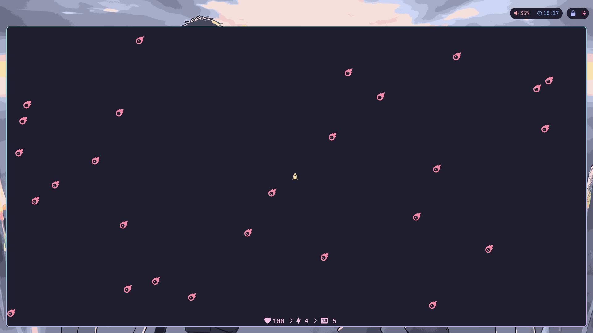

# MeteorMayhem



<p align="center"><i>🚀 A fast-paced <strong>ncurses</strong> space game in your terminal</i>
</p>

**MeteorMayhem** is a fast-paced terminal space game where you dodge and destroy falling meteors. Control a rocket, shoot with precision, and survive as long as you can. Use strategy to manage your health and limited rays while aiming for the highest score. Simple controls, ASCII or NerdFont graphics, and real-time action make it a fun and lightweight console experience.

## Usage

```
Usage: meteormayhem [OPTION...]

 User Interface Options:
  -n, --nerdfont             Prefer using NerdFont with utf-8 encoding
  -s, --statistics[=VISIBLITY]   Change player statistics' VISIBLITY

 Information Options:
  -?, --help                 Give this help list
      --usage                Give a short usage message
  -V, --version              Print program version

Mandatory or optional arguments to long options are also mandatory or optional
for any corresponding short options.

Report bugs to ashkanfeyzollahi@gmail.com.
```

## Features

* Terminal-based.
* Control a rocket with keyboard (WASD or arrows).
* Shoot meteors using E (costs ammo called "rays").
* Health and rays regenerate over time.
* Game ends when health hits zero or you press Q.
* Optional stats display and NerdFont support.
* Uses ncurses for visual interface and color.

## Compiling

### Dependencies

* `ncurses`, preferably latest stable version.

### Steps On Compiling

Compiling the program is as easy as stealing a candy from a baby.

1. Clone this repository

```bash
git clone https://github.com/ashkanfeyzollahi/meteormayhem
```

2. Change directory to `meteormayhem` (obviously where it is been cloned to)

```bash
cd meteormayhem
```

3. Do `make`

```bash
make
```

## Acknowledgements

Thanks to these resources which taught me a lot:

- [NCURSES Programming HOWTO (book)](https://tldp.org/HOWTO/NCURSES-Programming-HOWTO/)
- [Step-By-Step Into Argp (book)](http://nongnu.askapache.com/argpbook/step-by-step-into-argp.pdf)

