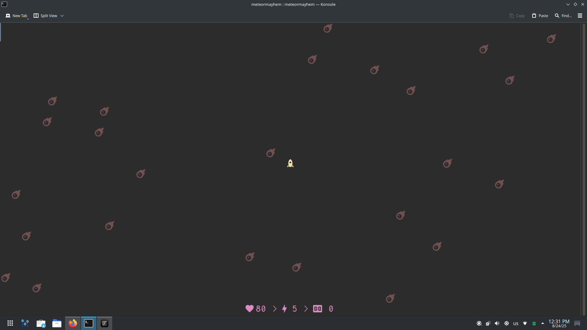

# Meteor Mayhem



<p align="center">🚀 Fly through space, while dodging and destroying meteors and trying to gain score!</p>
<p align="center">
    <a href="#features">Features</a> |
    <a href="#compiling">Compiling</a> |
    <a href="#acknowledgements">Acknowledgements</a> |
    <a href="CHANGELOG.md">CHANGELOG.md</a> |
    <a href="TODO.md">TODO.md</a>
</p>

```
Usage: meteormayhem [OPTION...]

 User Interface Options:
  -n, --nerdfont             Prefer using NerdFont with utf-8 encoding
  -s, --statistics[=VISIBLITY]   Change player statistics' VISIBLITY

 Information Options:
  -?, --help                 Give this help list
      --usage                Give a short usage message
  -V, --version              Print program version

Mandatory or optional arguments to long options are also mandatory or optional
for any corresponding short options.

Report bugs to ashkanfeyzollahi@gmail.com.
```

## Features

1. **Text-Based Interface:**

   * Runs in the terminal using the `ncurses` library for display and input.
   * Supports colored text and bold formatting.

2. **Nerd Font and ASCII Support:**

   * Option to use Unicode Nerd Font symbols or simple ASCII characters for all game elements (heart, meteor, player rocket, rays).
   * Configurable via command-line flag (`--nerdfont` or `-n`).

3. **Player Controls:**

   * Move player character (rocket) using arrow keys or `WASD`.
   * Fire rays upwards using the `E` key.

4. **Gameplay Mechanics:**

   * Meteors randomly spawn at the top of the screen and fall downwards.
   * Player can shoot rays upwards to destroy meteors and gain points.
   * If a meteor hits the player, the player loses health.
   * Player starts with 100 health points and 5 rays (ammo).
   * Rays decrease by one per shot.

5. **Health and Ammunition Regeneration:**

   * Every 30 seconds, the player regains 10 health points and 2 rays.

6. **Score System:**

   * Player earns 5 points for each meteor destroyed.

7. **Dynamic Screen Handling:**

   * Supports resizing the terminal window.
   * Adjusts meteor tracking array accordingly.

8. **Statistics Display:**

   * Shows player health, number of rays left, and score at the bottom of the screen.
   * Statistics visibility can be toggled via command-line option `--statistics visible|invisible`.

9. **Game Over Condition:**

   * Game ends when player health reaches zero or the player quits by pressing `q`.
   * Displays final score after game ends.

10. **Performance:**

    * Updates meteor positions every 0.1 seconds.
    * Spawns meteors randomly every 0.1 seconds.

## Compiling

Compiling the program is as easy as stealing a candy from a baby.

1. Clone this repository

```bash
git clone https://github.com/ashkanfeyzollahi/meteormayhem
```

2. Change directory to `meteormayhem` (obviously where it is been cloned to)

```bash
cd meteormayhem
```

3. Do `make`

```bash
make
```

## Acknowledgements

Thanks to these resources which taught me a lot:

- [NCURSES Programming HOWTO (book)](https://tldp.org/HOWTO/NCURSES-Programming-HOWTO/)
- [Step-By-Step Into Argp (book)](http://nongnu.askapache.com/argpbook/step-by-step-into-argp.pdf)

